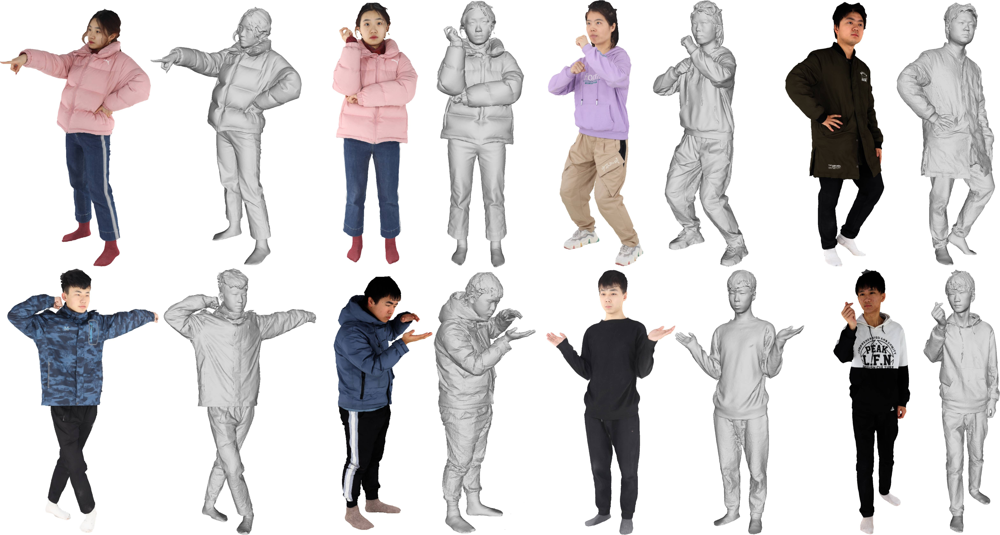

# PIFu: Pixel-Aligned Implicit Function for High-Resolution Clothed Human Digitization


## Installation
Same environment as the original [PIFu](https://github.com/shunsukesaito/PIFu) repo.


#### To install only the necessary packages for preprocessing. 

Conda environment
```
conda create -n pifu python==3.10
```


Install pyembree
```
conda install -c conda-forge pyembree
```

Install other packages
```
pip install -r requirements.txt 
```

## Process THuman Dataset 


Request access to the authors of the [THuman Dataset](https://github.com/ytrock/THuman2.0-Dataset) and extract/unzip the downloaded dataset. 

### Folder hierarchy
- Once you sucessfully downloaded and extracted the dataset, you should have the following files in your directory:
    ```
    ./THuman2.1/
    ├── 0000
    │   └── 0000.obj
    │   └── material0.jpeg
    |   └── material0.mtl
    ├── 0001
    │   └── 0001.obj
    │   └── material0.jpeg
    |   └── material0.mtl
    └── 0002
    │   └── 0003.obj
    │   └── material0.jpeg
    |   └── material0.mtl
    .
    .
    .
    ```

### Preprocess
1. Run [precomputed radiance transfer (PRT)](https://sites.fas.harvard.edu/~cs278/papers/prt.pdf).
 Warning: the following code becomes extremely slow without [pyembree](https://github.com/scopatz/pyembree). Please make sure you install pyembree.

```
python -m apps.prt_util -i {path_to_thuman_data}
```
This will create a *bounce* directory following this hierarchy. 

 ```
    ./THuman2.1/
    ├── 0000
    │   └── bounce
    │        └── bounce0.txt
    │        └── face.npy
    │   └── 0000.obj
    │   └── material0.jpeg
    |   └── material0.mtl
    .
    .
    .
 ```

2. run the following script. Under the specified data path, the code creates folders named `GEO`, `RENDER`, `MASK`, `PARAM`, `UV_RENDER`, `UV_MASK`, `UV_NORMAL`, and `UV_POS`. Note that you may need to list validation subjects to exclude from training in `{path_to_training_data}/val.txt` (this tutorial has only one subject and leave it empty). If you wish to render images with headless servers equipped with NVIDIA GPU, add -e to enable EGL rendering.
```
python -m apps.render_data -i {path_to_thuman_data} -o data [-e]
```

3. Preprocessed files will be ready for training PIFu in the `data` directory.


## Citation
```
@InProceedings{saito2019pifu,
author = {Saito, Shunsuke and Huang, Zeng and Natsume, Ryota and Morishima, Shigeo and Kanazawa, Angjoo and Li, Hao},
title = {PIFu: Pixel-Aligned Implicit Function for High-Resolution Clothed Human Digitization},
booktitle = {The IEEE International Conference on Computer Vision (ICCV)},
month = {October},
year = {2019}
}
```

```
@InProceedings{yu2021function4d,
  title={Function4d: Real-time human volumetric capture from very sparse consumer rgbd sensors},
  author={Yu, Tao and Zheng, Zerong and Guo, Kaiwen and Liu, Pengpeng and Dai, Qionghai and Liu, Yebin},
  booktitle={Proceedings of the IEEE/CVF conference on computer vision and pattern recognition},
  pages={5746--5756},
  year={2021}
}
```